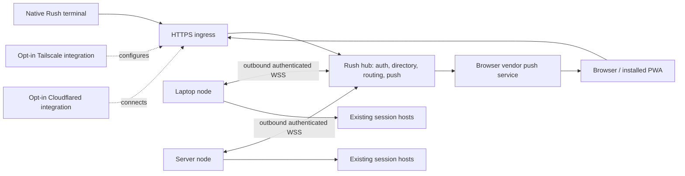

# Remote Rush: nodes, hub, clients, and connectivity

Status: proposed implementation plan, revised after detailed self-review, 2026-10-09. Planning only; no feature code or infrastructure changed. Read with [the review](remote-rush-plan-review.md). Commands, routes, package names, and defaults below are proposed unless explicitly identified as existing.

## 1. Outcome and agreements

Run agents on a server and control them from a local Rush terminal. Also open one web app on a phone or laptop to see and control Rush-managed agents across several machines. Agents continue when a client disconnects. Each machine remains responsible for its own execution and files.

The user's concrete deployment is a private app at `https://rush.thuis.forbes.red`, reached over Tailscale, combining agents from laptops and servers. The product must also support Cloudflare Tunnel as an alternative browser access path. Both integrations are **bundled plugins, opt-in and disabled by default**. They may coexist. Ordinary local Rush remains useful with neither enabled.

Agreed requirements:

- Persistent server execution and a native terminal client, not just a browser terminal.
- Multiple execution machines under one hub and web origin.
- A responsive web interface for conversations, decisions, progress, creation, and other common Rush workflows.
- Phone notifications, including when the app is not open.
- Configurable hostname; correct DNS and HTTPS setup rather than assuming a custom name inherits Tailscale certificates.
- Reuse Rush's existing session hosts and agent-neutral model.
- Plan and review before implementation; no deployment authorization is implied by this document.

Proposed defaults, not additional user agreements:

- One personal owner, multiple paired client devices, one hub per enrolled node initially.
- macOS and Linux nodes/hubs; Windows is not a release commitment.
- The hub is always on; laptop nodes may disappear and return.
- Tailscale is the first validated transport; Cloudflared ships as a separate opt-in integration after its own acceptance gate.
- An authenticated Rush device-pairing flow works on either transport. Optional upstream SSO can follow without changing node control.
- First release controls Rush-managed sessions. Externally discovered sessions may be displayed read-only with an explicit capability label.

Not part of this project: live migration of agents, automatic repository syncing, provider credential syncing, a general remote shell/desktop, a full IDE, multi-tenant hosting, public anonymous links, federation between hubs, distributed scheduling, arbitrary plugin UI inside the browser, and inference routing. The separate [substrate proposal](substrate.md) concerns provider traffic and must not be absorbed into this control-plane project.

## 2. Current implementation and affected seams

Planning baseline: working tree based on `d45fca1ac995f880d699f78420443e8698c539f7`, with substantial pre-existing uncommitted changes. Revalidate the listed seams before editing; this plan does not claim those changes belong to this work.

| Existing seam | Evidence | Consequence |
| --- | --- | --- |
| Detached per-session hosts | [host/client.go](../internal/host/client.go), [host/host.go](../internal/host/host.go) | Keep these as execution owners. A hub is not a replacement agent runtime. |
| Safe idle retirement and explicit wake | [host/sleep.go](../internal/host/sleep.go) | Listing/history must not wake agents. Explicit commands can wake eligible sleeping sessions. |
| Neutral messages, tools, decisions, plans | [agent/event/event.go](../internal/agent/event/event.go) | Export a deliberately versioned network representation; do not render ANSI in the browser. |
| Adapter capabilities and history interfaces | [agent/adapter.go](../internal/agent/adapter.go) | Advertise per-provider capabilities and fetch history on the execution machine. |
| Local host protocol, currently Proto 11 | [host/hello.go](../internal/host/hello.go), [host/host.go](../internal/host/host.go) | Network protocol needs its own version. Old hosts cannot be assumed to provide new reliability guarantees. |
| Bounded replay, disconnect of slow consumers | `record`, `trim`, `serve`, `conn.push` in [host/host.go](../internal/host/host.go) | Add explicit cursors, snapshot boundaries, and gap recovery rather than forwarding the local socket verbatim. |
| Commands currently yield errors without a general correlated success reply | `op`, `do`, `serve` in [host/host.go](../internal/host/host.go) | Reliable mutations require host acknowledgments and command identity, not gateway-only deduplication. |
| Pending decisions are host-owned | `pending`, `allow`/`deny` in [host/host.go](../internal/host/host.go) | Obtain an authoritative pending-decision snapshot; an old approval event is not proof it is still actionable. |
| UI loads filesystem/process/git/plugin state | [ui/snapload.go](../internal/ui/snapload.go), [fleet/fleet.go](../internal/fleet/fleet.go), [ui/rushmode.go](../internal/ui/rushmode.go) | Introduce a backend boundary. A remote view must not inspect the client's similarly named local path. |
| Desktop notifications and some lifecycle observations live in UI | `notify`, `hibernate` in [ui/model.go](../internal/ui/model.go), `reap` in [ui/cleanup.go](../internal/ui/cleanup.go) | Headless remote service needs its own authoritative observations; don't move unrelated external-session cleanup blindly. |
| Existing CLI controls sessions | [cmd/rush/session.go](../cmd/rush/session.go) | Reuse validation/control semantics and extend CLI target selection rather than inventing an unrelated control stack. |
| Bundled optional plugins already exist | [plugin/bundled.go](../internal/plugin/bundled.go), [cmd/rush/bundled.go](../cmd/rush/bundled.go) | Register both plugins with `Optional: true`; preserve existing on/off management. |
| Bundled manifest currently rejects network/exec declarations | `validateBundled` in [plugin/bundled.go](../internal/plugin/bundled.go) | Add an explicit, bounded first-party connectivity contract; don't pretend today's manifest can express it. |
| Installed plugins are constrained and own only their sessions | [plugins/ARCHITECTURE.md](../plugins/ARCHITECTURE.md), [plugind/sessions.go](../internal/plugind/sessions.go) | Remote control belongs in core, not a bypass of third-party plugin protections. |
| Plugin runner supervision already exists | [plugind/runner.go](../internal/plugind/runner.go) | Reuse it, adding orderly shutdown/owned-child cleanup where necessary; don't create competing plugin supervisors. |
| Go install is the documented distribution path | [README.md](../README.md), [go.mod](../go.mod) | Ship embedded web assets without requiring Node.js on users' machines. |

The adapter-neutral boundaries in [multi-agent.md](multi-agent.md) still apply: core packages use `internal/agent`; `cmd/rush` registers adapters. Remote packages must not switch on provider-specific wire formats or import adapter internals.

## 3. Architecture and ownership

### 3.1 Three roles, one product

**Node service:** one process per Rush state directory/user, on each execution machine. Provides local discovery, sanitized snapshots, history, workspace catalog, capability checks, and commands. Talks to existing hosts using their private Unix sockets. Maintains a connection to its configured hub. It does not require the terminal UI to be running.

**Hub service:** the durable entry point for clients. Hosts the web app/API, authenticates clients and nodes, maintains the machine directory and last-known state, routes commands, and dispatches notifications. It may run without provider CLIs or any local agents. If the same machine executes agents, its node registers through the same service contract.

**Clients:** local Rush terminal, remote Rush terminal, and browser/PWA. They consume common domain resources and capability descriptions. Each owns its view, selected session, scroll position, and drafts. Agents do not depend on a client connection.

The WSS connection is a typed application channel for commands/events, not a general-purpose reverse proxy. Nodes make outbound connections, which works behind NAT and means the phone only needs to reach the hub. A slow or unreachable node must not hold up another node's list or commands.

The hub is an availability dependency for remote control and new push delivery, not for ongoing agent execution. Hub failure leaves local terminal use and session hosts operating. No automatic election, replicated hub, or second command authority in v1.

### 3.2 Stable identities and local ownership

Use an opaque persistent `hub_id`, a persistent random `node_id`, and session identity `(node_id, host_session_id)`. Provider conversation IDs are metadata, not global keys. Keep a separate connection generation and host incarnation/epoch. Machine labels and DNS names are mutable and never identity keys.

A node advertises only explicitly shared workspaces. A workspace gets a node-scoped ID, display name, canonical root, and supported spawn profiles. Displaying a session never grants access to its entire parent filesystem. Same repository on two machines remains two workspaces; optional grouping by sanitized repository identity is presentation only and excludes embedded remote credentials.

The node owns transcripts, tools, provider logins, worktrees, queues, and policy. The hub never receives provider API keys or a generic agent environment. Clients submit workspace/profile IDs and supported options, not arbitrary binaries, environment variables, shell flags, `HOME` values, or unrestricted filesystem paths.

One node initially registers with one hub. Cloning a state directory must not silently create two live machines with the same identity: reject concurrent ownership and show instructions to re-enroll the clone. Removing a node revokes future access and closes its channel; it does not stop its agents or delete files.

Fence each node connection with a hub-issued generation. Replace a disconnected channel only through an authenticated resume that advances the generation and invalidates the prior channel; all routed commands/events carry it. The node rejects dispatch from an obsolete channel and serializes against its locally held instance lock. A second independently running node claiming the identity is a conflict, not a silent takeover. A command already accepted before fencing retains its recorded outcome; fencing does not undo external work. Client-side timestamps alone never decide which connection or snapshot is newer.

### 3.3 Data and retention

Node durable metadata: identity/credentials, shared workspace catalog, local command outcome journal, and settings. Hub durable metadata: enrolled nodes, client sessions, scoped grants, last-known summaries, command receipts, notification outbox/subscriptions, and a bounded audit trail.

Propose one embedded SQLite database per role for transactions and uniqueness constraints, never a network-mounted/shared database. Select and pin a maintained pure-Go driver in the foundation spike; measure its binary/build impact against the current Go-only distribution. Do not introduce an external database, message broker, or Redis. Before selecting a different store, demonstrate equivalent atomic command/outbox behavior and crash recovery.

Each role's process is the sole writer of its database. Existing session hosts must not all open the node database as writers. Host execution deduplication uses a per-session durable command journal owned by that host, next to its saved state, with a startup/writer lock, flushed pre-dispatch and outcome records, bounded compaction, and corruption detection. Define one journal helper and test crash boundaries; do not develop a general storage engine. Journals survive idle host retirement and incarnation changes. Node/hub receipts mirror the authoritative host outcome; they do not replace it.

Do not duplicate full transcripts at the hub in v1. Fetch bounded pages from online nodes; keep only in-memory active-view caches. When a node is offline, retain its roster and pending-attention summary marked stale; explain that uncached history cannot be fetched. Full offline transcript replication is a later opt-in feature with its own retention decision.

Proposed bounds: 30 days of metadata-only audit entries; 7 days of terminal command outcomes plus unresolved outcomes retained until reconciled; per-session replay bounded by both bytes and age; expire unused pairing requests after 10 minutes. These are configurable engineering defaults to tune with tests, not a promise to retain all history. Command IDs older than the supported dedupe window are rejected as expired, never treated as fresh mutations.

Define the dedupe validity window using a server-issued client/session epoch and accepted-at time. Do not trust a client to refresh an old command by changing its timestamp; the complete identity/payload is immutable. Expired epochs require reconnect/reconciliation before new commands. Journal pruning retains enough epoch/tombstone information to reject expired retries. Unknown outcomes are surfaced and never silently removed by routine retention.

## 4. Service protocol, correctness, and lifecycle

### 4.1 Domain resources and interfaces

Implement an internal backend interface with local and remote implementations. Keep the network DTOs separate from private `host.Config`, process snapshots, and filesystem paths. The remote interface supplies:

| Resource/operation | Required contract |
| --- | --- |
| Service info | Hub/node identity, protocol range, build, capabilities, clock, supported limits |
| Machines | Label, availability, last contact, OS, advertised features, transport health |
| Workspaces | Approved roots represented by IDs, branch/worktree information, spawn options |
| Sessions | Composite ID, machine/workspace, lifecycle, provider/model, usage, parent/child links |
| Session snapshot | Current display state, ordered materialized conversation tail, pending decisions, queue, tasks, cursor |
| History | Bounded opaque pagination, stable message identity, explicit truncation; never fetch-all by default |
| Subscription | Authorized resource topics, snapshot/cursor boundary, deltas, gap/reset marker |
| Create | Workspace/profile, prompt, supported model/effort, optional worktree; deterministic request identity |
| Commands | Send, queue, steer, interrupt, explicit stop/resume, supported model/effort changes, decision answers |
| Changes | Read-only repository diff and file snippets within shared workspace; bounded output |
| Attachments | Opaque IDs, verified media type/size, authorization on every fetch |
| Notifications | Per-client opt-in subscription, preferences, test, unsubscribe, delivery health |
| Administration | Node/client enrollment and revocation; connectivity configuration via local administration first |

Choose ordinary HTTPS JSON for client queries/commands and one multiplexed WebSocket for events. Nodes use one authenticated WSS channel with typed request/reply/event envelopes. Same domain contracts apply on both sides. No gRPC requirement, bespoke encrypted transport, remote filesystem mount, or raw host socket exposure. Use maintained libraries for WebSocket, SQLite, and Web Push rather than implementing those standards.

Proposed route families: `/api/v1/info`, `/machines`, `/workspaces`, `/sessions`, `/commands`, `/events`, `/notifications`, and a separately authenticated node channel. Stable web routes include `/machines/:id` and `/sessions/:node/:session`. Exact spelling is an implementation detail; resource identity and authorization are not.

The handshake negotiates protocol major/minor and capabilities. Unknown optional event types can be skipped; missing required semantics force a readable incompatibility response. Old hosts can remain visible, but unsupported new mutation guarantees must disable remote controls until a safe host upgrade/restart. Never kill active work just to upgrade the host protocol.

### 4.2 Snapshot and replay

Define per-topic or per-session ordered cursors, not a false global order across machines. Each cursor includes an epoch plus sequence. Snapshot generation must establish an atomic watermark and subscribe to all events after it. Reconnecting with a cursor replays only subsequent events; overflow, process replacement, or an unavailable watermark produces a reset and fresh snapshot.

The host or node projection must capture pending approvals/questions under the same consistency boundary as its watermark. Replaying an old approval without its later cancellation is not acceptable. The materialized snapshot must be buildable when no browser or TUI was connected.

Retain the complete structured payload of every live question/approval independently of the bounded transcript replay ring, until resolution/cancellation. Current host `pending` entries and the display `Needs` string are insufficient to reconstruct all fields; explicitly add the retained payload to host-owned state. Include offered options and question fields in the snapshot, but never revive a request solely from a persisted transcript after its host incarnation is lost.

Use message/part IDs and offsets or revisions to prevent duplicated streamed text when snapshots and deltas meet. Completed messages replace their streamed provisional representation by ID. History page boundaries must not depend solely on timestamps, which can tie or change across provider readers. Provide opaque continuation tokens and deduplicate by stable IDs; synthesize deterministic IDs for imported records that lack them.

Per-client bounded queues; coalesce replaceable status/progress updates, never silently discard decisions or command outcomes. If a client falls too far behind, disconnect with resync-required. Limit open subscriptions, frame size, concurrent history reads, and per-node work. Transcript/output payloads exceeding a frame limit become chunked resources, not larger unlimited frames. Never hold a host's execution mutex while writing to a network client.

Starting test defaults: 1 MiB control/event frame limit, 256 KiB output chunks, 100 items and 1 MiB per history page, 4 concurrent expensive reads per client, 10 MiB per uploaded image with a decoded pixel cap, and explicit per-client subscription limits. Oversized single messages use chunked fetches with visible truncation where necessary; they must not disappear. Expose negotiated limits and stable errors. Tune byte limits with representative tool/image fixtures rather than unbounded exceptions.

A node continuously observes its active managed hosts for summaries, decisions, terminal outcomes, and host lifecycle even when no client is subscribed. High-volume transcript delivery to the hub remains demand-driven. New hosts are discovered through local state watching with periodic reconciliation. Observing must not count as work that prevents safe idle retirement. Maintain a bounded node-side journal for critical attention events; on hub reconnect replay retained event IDs and send an authoritative current summary. If retention was exceeded, mark a gap and reconcile pending attention from a snapshot; do not fabricate missed completion events or resend every historical failure.

### 4.3 Mutation acknowledgments and retries

Every mutation has a random command ID, authenticated actor, target, operation, canonical payload hash, creation time, and applicable expected revision/incarnation. Outcomes are `received`, `accepted`, `completed`, `rejected`, or `unknown`; define `accepted` as the node/host committing responsibility for the action, not merely the hub receiving bytes. A completed send means input was accepted by the agent/queue, not that the model finished its turn.

Deduplicate at the final execution boundary. Repeating the same command ID/payload returns the prior outcome; using the ID for a different payload is rejected. Persist before dispatch and after outcome. A crash between an external effect and recording success is inherently ambiguous: report unknown and reconcile where possible; do not promise exactly-once provider execution or automatically resend an ambiguous prompt.

Extend the local host protocol with correlated outcomes and host-side command identity so hub/node retries do not duplicate messages. Spawn uses a preallocated session ID written with the command record, then checks that identity after a retry. All entry points to host decisions must share the same serialization; a local terminal can race a phone too.

For spawn, reserve **both** the full provider conversation ID and Rush host ID under a per-target creation lock before calling `Spawn`; current `Config.fillIDs` can overwrite an ID if `SessionID` is empty. Persist the command-to-session mapping first. Retry may reuse a directory only if its recorded creation command matches; never overwrite another stopped session's configuration on an ID collision. Reconcile startup timeout by inspecting the reserved host and command record, not by allocating a fresh session. Test collision, partial config creation, process-start timeout, and two concurrent identical requests.

Hub/node/journal write failure before acceptance rejects new remote mutations. A failure after dispatch marks the result unknown and blocks unsafe retries; don't claim durable success. Preserve already running agents and local access where their own storage remains healthy. Enter a visible read-only/degraded mode on full disk, unwritable state, corrupt journal, or failed migration, with an operator recovery path. An intentional local emergency interrupt/stop remains available, is labeled as bypassing unavailable remote accounting, and must not require the hub database to be healthy.

Offline machine commands fail promptly with `node_unavailable`; retain the user's draft. Do not queue new execution requests at the hub for surprise execution hours later. A message explicitly accepted into the existing host queue before disconnection remains queued there, and is shown as such after reconnect.

### 4.4 Decisions and concurrent clients

Pending decision identity includes session incarnation and request ID; expose offered option IDs and actual effects, including persistent permissions. First valid response reserves the request; other clients see resolving/resolved rather than presenting it as still open. Commit resolved only after the provider accepts; a provider error produces failed/unknown resolution requiring authoritative refresh. Do not re-present the same approval as safe to retry if its effect may already have occurred.

This is a real host seam: the current allow/deny path removes a pending request before calling the provider. Specify the new state transitions and tests rather than relying on the existing lock alone. Questions retain their structured asks, single/multiple selection, and supported free text. Cancelled or old-incarnation answers fail with a stable conflict response.

Multiple views may read simultaneously. Serialize mutations per session; distinguish queued input, steering, and interrupt-and-send. Queue entries need stable IDs and revisions rather than index/text matching alone, particularly for two identical queued messages. Model/permission changes and destructive controls use expected revision checks. No per-keystroke shared composer; drafts are client-local. A future raw terminal would need an input-controller lease, but is excluded here.

### 4.5 State distinctions

| Event | Result |
| --- | --- |
| Browser/TUI closes | Hosts continue; stop streaming that client's high-volume topics |
| Node loses hub connection | Local agents continue; hub marks node reconnecting, then offline |
| Hub restarts | Nodes reconnect and refresh; accepted local work continues; clients resync |
| Safely idle host retires | Saved session remains visible; reading does not wake it |
| User sends to eligible sleeping session | Ensure once under startup lock, then deliver once |
| User explicitly stops an agent | Remains stopped until an explicit supported resume/restart action |
| Laptop sleeps | Node becomes unavailable; no claim that execution continues during sleep |
| Host crashes mid-turn | Mark interrupted/lost; preserve history and unresolved outcomes; no silent restart |
| Machine reboots | Service may restart after configured OS login/startup; agent resumption follows explicit policy, initially manual |
| Tunnel/plugin is disabled | Remove only its exposure/owned connector; preserve core/local execution |

Use heartbeat and last-seen timestamps with a configurable grace period; distinguish an agent waiting for a user from a machine being unavailable. Do not label offline machines' cached sessions as currently working. Show both last-known agent state and current machine reachability.

## 5. Authentication, authorization, and trust

Tailscale membership and a Cloudflare tunnel are network access, not a universal Rush owner role. Use one Rush authorization model regardless of ingress. Initial setup creates a local administrator through the hub's protected local CLI/socket, never an unauthenticated first-visitor takeover.

Proposed browser/client pairing: the browser or native client creates a short-lived pairing request with a high-entropy private polling secret and a human comparison code. The owner approves the specific request from an already authorized local CLI or client, seeing target hub, client label, requested rights, and matching code. The short code is not a bearer credential. Rate-limit requests and polling, expire and consume requests once, prevent code enumeration, and send secrets only in request bodies/headers. New remote clients cannot approve themselves. Node enrollment similarly exchanges a one-use scoped invitation for a node credential and requires a deliberate local selection of shared workspaces.

Browser sessions use host-only Secure HttpOnly cookies, SameSite policy, CSRF checks on mutations, exact Origin checks for WebSocket, and a fixed allowed host/origin list. No tokens in URLs or localStorage. Native clients and nodes use separate scoped credentials over verified TLS, stored in protected state/key storage. Store only token hashes at the verifier. Node credentials can publish their own state and receive their own commands; they cannot list/control other nodes or mint clients.

The first personal-owner role can control approved workspaces; keep `view`, `control`, and `admin` distinct internally. Local node policy is the final ceiling even if the hub asks for more. Reject path traversal, symlink escapes, unrestricted account switching, arbitrary host configuration, and operations unsupported by the provider. The web is not an endpoint for exporting provider credentials. Permission-mode changes require explicit UI and node policy; never silently select a mode that skips questions.

Revocation closes live event channels as well as rejecting new requests. Invalidate push subscriptions for revoked clients and stop sending future notifications; already delivered OS notifications cannot reliably be recalled. Bound credential/session lifetime and revalidate authorization on long-lived streams. Rate-limit pairing, spawn, history/search, and attachment endpoints separately. Audit actor, target, operation and outcome, not full prompts, secrets, or file contents.

Pairing is separate from network setup: enabling a plugin cannot enroll an owner or grant it administrative control. Browser pairing endpoints expose only minimal request state until approval. Protect against login CSRF by binding the approved request to the requesting browser's secret and intended hub/origin. A lost administrator device is recoverable through the local hub CLI; remote unauthenticated recovery is excluded. When Access is configured as a required extra gate, validate it on stream establishment and end the stream no later than its token expiry; a prior WebSocket handshake is not indefinite authorization. Document any provider-side revocation detection delay instead of promising instant SSO revocation.

Optional identity integrations later: trust Serve identity headers only on a dedicated local ingress protected against bypass; tagged devices don't carry user headers. Validate Cloudflare Access JWT signature, issuer, audience, and expiry if using it as identity; an email header alone is insufficient. An identity from either system must map to an allowed Rush owner. A custom-domain reverse proxy does not automatically preserve trustworthy Tailscale source identity. [Tailscale identity](https://tailscale.com/docs/concepts/tailscale-identity), [Access JWT validation](https://developers.cloudflare.com/cloudflare-one/access-controls/applications/http-apps/authorization-cookie/validating-json/).

Trust boundaries include potentially malicious tool output, repository files, node labels, and links. Render Markdown with raw HTML disabled and sanitized URLs; never execute output as HTML or script. Use a restrictive Content Security Policy, no third-party analytics, no remote script CDNs, and no automatic remote image fetches. Serve attachments via authorized opaque IDs and safe content disposition. Network access is a privileged feature and must not be exposed as an agent-callable plugin tool that can publish its own session.

For image input, allow a small set of raster formats, verify actual bytes and decoded dimensions, and reject active formats such as HTML/SVG. Uploads are staged on the target node under a protected generated name, scoped to the authenticated client/workspace, and expire if never attached. The send command references only authorized staged IDs; it never accepts client-supplied filesystem paths. Clean abandoned uploads after bounded retention and enforce aggregate storage quotas. File serving must use race-resistant confined opens and recheck access at use time, not only a string-prefix or earlier symlink check. Worktree roots deliberately created by Rush are explicitly registered even when outside the original repository directory.

## 6. Bundled connectivity plugin contract

### 6.1 Scope and supervision

Register `tailscale` and `cloudflared` as optional bundled plugins. Their UI and CLI surface belongs in existing Settings → Plugins and existing plugin management. Add a Remote section for hub/node configuration and read-only exposure status, linking to the relevant plugin rather than duplicating settings ownership.

Extend the first-party bundle descriptor with a narrowly typed connectivity role and broker methods for reading a designated local hub endpoint, reporting status, and performing explicit setup/shutdown. Only registered built-ins can claim this role. Do not relax installed-plugin sandbox, private-address restrictions, or session ownership. Today's `Network`/`Exec` manifest rejection for bundled plugins remains accurate until this new role is implemented and described honestly.

The plugin owns provider-specific arguments/configuration; the existing broker owns plugin lifecycle. Add an orderly shutdown request with a deadline, then terminate verified owned children/process groups. Use an ownership record containing executable identity, process start identity, and provider resource IDs; PID alone is not sufficient. A broker restart reconciles ownership before spawning replacements. Audit behavior when the plugin, broker, hub, or external daemon crashes independently.

Plugins run independently of any open terminal, provided their configured role is active. If no hub endpoint exists, report waiting-for-hub rather than start an empty tunnel. They never stop session hosts or uninstall the user's networking software. All setup actions have structured arguments; no shell interpolation. Log redaction and sensitive file handling are required for both plugins.

Common state machine: disabled → setup required → connecting → ready, with dependency missing, login required, permission required, conflicting configuration, degraded, and cleanup required as explicit states. Enabled is not synonymous with publicly reachable. Status includes intended audience, actual origin, endpoint owner, observed connector health, and last error; health is verified, not inferred just from a live process.

Changing exposure is an explicit user action. Turning on the plugin opens setup; it does not silently publish a new endpoint. Turning it off takes effect on its own resources and reports any incomplete cleanup. Never run global reset/logout operations. No automatic dependency installation, system daemon replacement, or broad host configuration rewrite in v1.

Treat disabling as durable desired state before cleanup begins. Otherwise a broker crash between cleanup and saving settings could recreate the tunnel. After restart, reconcile disabled resources for cleanup only, not activation. Setup changes have a revision and an apply result; retrying setup with the same revision is idempotent. If the core remote-access switch is off, ingress rejects remote requests even if an externally owned proxy/tunnel remains alive. This switch does not kill agents and is distinct from selecting local-only UI mode.

The core switch also closes existing remote client/node channels and cancels requests not yet accepted. It cannot undo already accepted provider work; record those outcomes for later reconciliation. Report that node agents continue locally while aggregation/control is unavailable. Locally authenticated administration remains available to restore access.

### 6.2 Tailscale plugin

First implementation uses the user's installed `tailscale` CLI and daemon; it does not embed `tsnet` or create another device identity. Check executable provenance/version, daemon availability, logged-in tailnet, and permissions. Support platform-specific executable discovery, including macOS installations where CLI placement varies. Use bounded machine-readable status calls; do not repeatedly prompt for sudo or restart the system daemon.

Two modes:

| Mode | Plugin behavior | DNS/TLS owner |
| --- | --- | --- |
| Tailnet hostname | Configure an owned Serve endpoint to the loopback hub; display the resulting `.ts.net` HTTPS URL | Tailscale Serve |
| Existing custom-domain proxy | Check tailnet reachability and configured origin; no Serve mutation needed | Operator's proxy and DNS |

For the user's private custom domain, recommend the second mode. The plugin can validate the expected host, certificate, and hub identity from a connected client, and generate a precise setup checklist. It cannot issue a `forbes.red` certificate through Tailscale's `.ts.net` certificate facility.

Serve setup must inspect existing configuration first. Allocate an unused endpoint or report a conflict, record only the mapping Rush owns, and remove only that mapping when disabled. Prefer a supervised foreground Serve lifecycle if it demonstrably cleans up the owned mapping; otherwise use explicit persisted ownership/reconciliation. Validate behavior against the supported CLI version before committing to exact flags. A failed cleanup must remain visible and be retryable without a blanket `serve reset`. Do not change Funnel, advertised routes, exit-node selection, tailnet membership, or unrelated services. [Serve command](https://tailscale.com/docs/reference/tailscale-cli/serve).

Tailscale grants should restrict clients to the hub and participating nodes to their node-channel endpoint as deployment allows. The app still enforces roles. In custom proxy mode, disabling the plugin cannot turn off the user's existing system Tailscale connection; report that it stopped managing/checking the integration and explain which externally owned access remains. A separate core remote-access switch can reject remote traffic independent of transport.

### 6.3 Cloudflared plugin

Use installed `cloudflared` and a stable named tunnel. First support an existing remotely managed tunnel token plus configured public hostname. Guide the user through dashboard creation; don't require a broad Cloudflare account API token or silently edit DNS/Access policies. Automated provisioning with narrowly scoped credentials is a later enhancement.

The plugin runs its own connector child to a dedicated loopback hub ingress. Use token-file support where available (documented from cloudflared 2025.4.0) and protected files; never put the token in command-line arguments, frontend responses, ordinary config output, or logs. Protect the runtime token file throughout the process lifetime, remove on shutdown, and handle crashes/renewal. Keep the configured token in protected secret storage. Don't install a second global cloudflared service or adopt another service's PID. [Tunnel run parameters](https://developers.cloudflare.com/cloudflare-one/networks/connectors/cloudflare-tunnel/configure-tunnels/run-parameters/).

Public exposure requires configured Rush authentication before connector activation. Recommend Cloudflare Access as an additional gate; if enabled, verify its policy/expected audience through setup and an unauthenticated probe. A connector being healthy does not establish that Access is enforced. Reject origin bypass and validate Access JWTs if relied upon. Report edge certificate readiness separately from tunnel health.

Disable stops only Rush's connector. It does not delete DNS, revoke the tunnel globally, or stop other replicas. If other connectors use the same tunnel, say the hostname may remain reachable. Rotating credentials is a separate explicit operation. Provider-managed configuration changes require renewed health checks.

Quick Tunnels are excluded from the supported persistent product: they lack stable origins and have limitations, including SSE support. Do not let a temporary URL silently invalidate PWA installation or push subscriptions. WSS reconnect remains necessary even with named tunnels because edge deployments may terminate connections. [Quick Tunnel limits](https://developers.cloudflare.com/tunnel/get-started/quick-tunnels/), [WebSockets](https://developers.cloudflare.com/network/websockets/).

### 6.4 Coexistence and origins

Tailscale can connect nodes to the hub while Cloudflared exposes only the browser ingress. Keep node credentials off public browser APIs. A node may use a public hub origin only when a dedicated machine-auth path is explicitly configured; a browser Access login must not intercept machine traffic. The first recommended mixed deployment keeps node traffic private over Tailscale.

The same applies to a native terminal: interactive Access redirects cannot be treated as JSON errors and retried forever. First-release native clients use the private hub endpoint plus their Rush credential. If public-native access is offered, it must include a documented supported Access authentication flow and its own acceptance test; otherwise show a clear unsupported-endpoint message. Separate ingress policy and routing for browser versus node traffic; don't create a broad Access bypass covering session APIs.

Choose one canonical browser origin for installation, links, and push subscriptions. A second origin can be a separately authenticated browser entry point, but is a distinct cookie/PWA/push origin. Never promise that installing on `.ts.net` automatically transfers to `rush.thuis.forbes.red`. Migrating origin requires revisiting/reinstalling and resubscribing, with clear cleanup of old subscriptions. Do not redirect private users to a public alternate origin unexpectedly.

## 7. Hostname, DNS, TLS, and deployment

Treat three names separately: node label, node network address, and hub browser origin. `rush.thuis.forbes.red` names the hub, not every laptop. Multiple A records or multiple Cloudflare connectors pointing at unrelated laptop hubs would load-balance separate state, not combine agents. Aggregation is a Rush service responsibility.

For the private custom-domain deployment:

1. Run the hub on an always-on home server or VPS under a dedicated normal OS user.
2. Run Tailscale on that server and the clients/nodes that need it.
3. Point the custom hostname at the hub's Tailscale address using DNS-only public DNS, or a private resolver configured with Tailscale split DNS. Reuse the user's existing DNS approach where possible.
4. Terminate HTTPS at the existing reverse proxy on the tailnet interface; forward to a loopback Rush ingress. If the proxy runs on a different host, secure and authenticate that hop rather than exposing unauthenticated HTTP on the LAN.
5. Use a certificate for the exact name or `*.thuis.forbes.red`. A certificate for only `thuis.forbes.red` or `*.forbes.red` is insufficient.
6. If no matching certificate exists, automate ACME DNS-01 with a narrowly scoped DNS provider credential; public DNS validation can work while the application stays private. Private split DNS still needs publicly verifiable ACME challenge records or delegation.
7. Validate from a real phone over cellular with Tailscale, not just from the server itself. Verify DNS, certificate chain/name, allowed origin, login, streaming, sleep/resume, and deep links.

MagicDNS cannot store arbitrary custom records; Tailscale's DNS settings can direct selected domains to another resolver. [DNS in Tailscale](https://tailscale.com/docs/reference/dns-in-tailscale). Its automatic certificates are for the tailnet namespace. [Tailscale HTTPS](https://tailscale.com/docs/how-to/set-up-https-certificates). DNS-01 and proxy-specific provider modules must be configured, not assumed. [Let's Encrypt challenges](https://letsencrypt.org/docs/challenge-types/), [Caddy HTTPS](https://caddyserver.com/docs/automatic-https).

Cloudflare alternative: the public hostname resolves through Cloudflare to the named tunnel and its edge certificate. Verify coverage for the exact name. For a full Cloudflare zone at `forbes.red`, default Universal SSL generally covers the apex and first-level subdomains, not `rush.thuis.forbes.red`; advanced/Total TLS or a different supported zone/certificate setup may be required. The actual zone configuration is unknown. Do not promise this nested hostname is covered free by default. [Universal SSL limitations](https://developers.cloudflare.com/ssl/edge-certificates/universal-ssl/limitations/).

OS service installation is explicit. Plan systemd user/service units on Linux and launchd on macOS, including working directory, restricted state permissions, logs, and restart backoff. Do not assume a macOS login keychain is available before user login. Hub-only operation should not depend on provider logins. Agents executing after reboot must meet provider credential availability and explicit resume policy. Containers are an optional hub deployment, not a prerequisite; mounting host Docker sockets is unnecessary.

## 8. Native terminal experience

Preserve normal `rush` behavior. Proposed commands: `rush serve` for the node role, `rush hub` for hub role, `rush remote add/list/remove`, and `rush --remote <name>` for selecting a hub. A combined server invocation may start both roles, but they remain distinguishable in status. Existing `rush session` commands gain a target option and use the same backend contract. Exact command naming is to be checked against existing plugin CLI collisions.

Remote terminal behavior must include listing, open/history, send/queue/steer, decisions, create, interrupt/stop, model/effort selection where supported, task/subagent views, and read-only diffs. Show machine/workspace in the session header and confirmations. Local and remote sessions with the same provider ID remain distinct. A unified local-plus-hub list deduplicates a local node that is already in the hub using node identity, not names.

Audit every command and view before enabling it remotely: either route it through the node API, keep it explicitly client-local (theme/keybindings), or disable it with a reason. File open, git operations, provider sign-in, account switching, plugin installation, local shell actions, and cleanup must never accidentally run on the client when the selected session is remote. Remote account management and destructive workspace cleanup are deferred; read-only usage/status can ship earlier.

Migrate incrementally: keep the local backend in-process where possible, with existing host sockets, rather than requiring every desktop user to start a hub. Share DTO/projector logic and backend operations so remote clients do not become a second implementation of lifecycle policy. Terminal exit disconnects only. A separate explicit stop action names the remote session it affects.

## 9. Web app product and interaction plan

### 9.1 Information architecture and visual direction

The primary mobile task is to understand what needs attention and respond. Desktop adds space for comparison and details. Use Rush's existing amber/bottle identity, restrained typography, readable neutral surfaces, and semantic status colors backed by text/icons. Do not replicate terminal panes, ANSI colors, or tiny keyboard-only controls.

Mobile navigation: **Attention**, **Agents**, **Machines**, with settings in the account/menu. Desktop: left navigation and filters, middle session list, main conversation, optional details panel. At narrow widths, use full-screen drill-down with a stable back path; avoid nested horizontal panes. New-agent action stays reachable but separate from decision buttons.

| Screen | Content and primary action | Important states |
| --- | --- | --- |
| Connect/pair | Hub identity, client name, pairing status | Untrusted URL, expired request, denied/revoked device |
| Attention | Approvals, questions, failures grouped by urgency/project | Empty, resolved elsewhere, node offline, stale decision |
| Agents | Search/filter by project, machine, provider, working/idle/stopped | Loading, partial node failure, no shared projects |
| Conversation | Messages, tool details, progress, queue, composer | Streaming, older history, reconnecting, provider error |
| Changes | File list, unified diffs, expandable snippets | Binary/large file, unavailable node, changed base |
| New agent | Machine → workspace → profile/provider → prompt | Offline target, missing login, unsupported option |
| Machines | Online/last seen, shared projects, capabilities, version | Sleeping/unavailable, incompatible, revoked |
| Settings | This device, notifications, appearance, connectivity status | Permission denied, invalid HTTPS, setup required |

### 9.2 Core journeys

**Check work:** open the installed app; show the last-known roster immediately with freshness, then connect. Attention cards lead with the action needed, agent/project and execution machine. Cached status never masquerades as live. A short list of active sessions appears without downloading every transcript.

**Answer an approval:** open its card; see requested command/tool/path, workspace, reason, and exact offered permission options. Keep allow-once distinct from any lasting allowance. Disable double submission while the command is being acknowledged, not indefinitely. If answered elsewhere, show who/when where known and the canonical result. If unavailable, retain context but disable approval; never save an offline approval for automatic later execution.

**Answer a question:** preserve multiple asks, single/multiple choices, descriptions, and free text supported by that adapter. Keep partially entered answers on the client while switching screens. Validate against the current question revision before sending.

**Send or steer:** composer explicitly displays Send, Queue, or Steer according to session capability/state. Interrupt-and-send is a distinct action. Show pending/accepted/unknown outcomes; preserve the draft until acceptance. On reconnect reconcile by command ID before offering a new send. Typing in one device does not rewrite another device's draft.

**Read a long conversation:** load a recent window, fetch older pages on demand, retain scroll anchor, and show a new-activity affordance when reading earlier content. Fold tool calls by default but surface errors and requested decisions. Batch streaming updates without delaying a decision. Preserve task list and parent/subagent navigation. No auto-scroll jump while selecting/copying text.

**Create an agent:** choose the execution machine and one of its shared workspaces. Fetch that node's profile/model capabilities; no hard-coded list from the browser's environment. Optional worktree creation is explicit. Submit once with a command ID; navigate to the stable session route even if reconnect is needed. Missing provider login directs the user to that machine's setup, not to paste credentials into the web app.

**Investigate changes:** show bounded read-only diffs and file context. Clearly distinguish current working-tree changes from patches attributed to a specific turn when evidence supports that distinction. Never label all current modifications as agent-authored. No stage/commit/reset/merge controls in the first release.

**Recover connection:** display whether the phone, hub, or target machine is disconnected. Retry transport with bounded exponential backoff and jitter, refresh on foreground, and resync before enabling stale decisions. Keep navigation and saved drafts usable. An incompatible server version shows an actionable upgrade message rather than an endless spinner.

### 9.3 Feature coverage

| Feature | Initial complete remote release | Follow-up |
| --- | --- | --- |
| Fleet list, project/machine grouping, status, basic usage | Yes | Cross-machine accounting reconciliation |
| Conversation, tools, tasks, subagents, history | Yes, capability-aware | Rich provider-specific extras |
| Approvals/questions/send/queue/steer/interrupt/stop | Yes, supported operations only | Advanced queue editing after stable queue IDs |
| Spawn and optional approved worktree | Yes | Repository provisioning/cloning from UI |
| Model/effort changes | Yes where supported | Provider sign-in/account switching |
| Read-only diffs and bounded file context | Yes | Editing and Git writes |
| Image viewing and image prompts | Planned before feature-complete release, size-limited | General file upload/execution |
| PWA install and notifications | Yes after real-device gates | Notification actions beyond opening the app |
| External provider-native sessions | Read-only when discoverable, explicitly labeled | Interactive native terminal attachment |
| Session list filtering/name search | Yes | Full transcript search across machines |
| Plugin setup | Local CLI/TUI setup; browser status | Remote administration with stronger auth |
| Rooms/feed/community, efficiency advisor, cleanup, shell process control | Deferred and visible in parity documentation | Individual scoped additions |

This matrix defines the promised subset; it does not silently claim complete desktop parity. Basic summaries may show unsupported providers; unsupported controls are hidden or explained, never guessed.

### 9.4 Frontend engineering and accessibility

Propose a small React + TypeScript app built with Vite, using native HTML/CSS and a limited component set. No SSR, separate Node server, heavyweight editor, or runtime CDN. Pin dependencies/lockfile, choose maintained sanitization/highlighting libraries, and compare bundle cost in a small prototype before final package choices. Shared protocol fixtures/schema generate or validate TypeScript types; don't hand-maintain contradictory Go and TS contracts.

Separate server state, event projection, and view state. Use an explicit reducer for ordered events; test it with recorded provider-neutral fixtures. Bound caches and virtualize long lists/conversations without breaking keyboard/screen-reader navigation. Abort stale history/diff requests on navigation. Detect background tabs and reduce nonessential subscriptions, then refresh on return.

Accessibility acceptance: WCAG 2.1 AA audit, full keyboard access, labeled controls, visible focus, sensible focus return after dialogs, appropriate contrast, reduced motion, no status conveyed by color alone. Use approximately 44px touch targets for frequent phone actions. Announce decisions and connection changes via restrained live regions, not every token. Test text zoom, landscape, safe-area insets, and the mobile keyboard covering the composer. Never make swipe the only way to act.

Embed production assets in the Go binary. Commit reproducibly generated release assets (or an equivalent checked-in Go embedding artifact) so `go install .../cmd/rush@version` requires no JS build. Source frontend remains in a dedicated directory; maintainers rebuild with the lockfile, and CI/release checks detect stale assets. Serve content-hashed assets immutably; HTML, bootstrap configuration, and service-worker scripts revalidate. Keep dev server behavior separate from shipped origin/auth rules. Add a license inventory and avoid shipping development secrets or unnecessary source maps.

Client-side route fallback applies only to app navigation, never `/api`, the node channel, or attachment routes. API authentication failures stay structured errors and are not replaced by a login HTML page. After a deployment, existing tabs either receive compatible assets/API or a deliberate version-refresh state; don't leave them requesting deleted chunk names indefinitely.

## 10. PWA, push, and notification semantics

Serve a web manifest, icons, stable app ID and start URL, and a same-origin service worker over trusted HTTPS. Service workers are event-driven and may be terminated; they are not background WebSocket daemons. Foreground updates use the event stream; closed-app delivery uses standards-based Web Push. [Service Worker API](https://developer.mozilla.org/en-US/docs/Web/API/Service_Worker_API), [Push API](https://developer.mozilla.org/en-US/docs/Web/API/Push_API).

Flow: user explicitly enables notifications → browser permission → Push API subscription → authenticated registration with hub → hub outbox sends encrypted push using VAPID → browser vendor push service wakes worker → worker shows a minimal notification → click focuses/opens the canonical session URL and refreshes state. The push service does not need inbound access to the private hub. The hub needs outbound HTTPS; the phone needs tailnet access to fetch details/open the private app. Design the payload so notification display itself does not require fetching private content.

On iOS/iPadOS the baseline is a Home Screen web app and a user-initiated permission request; verify on actual supported OS versions. Include install instructions and feature detection rather than browser-name assumptions. Android browser behavior and background restrictions also require real-device testing. Do not promise guaranteed or immediate push delivery. [WebKit Web Push](https://webkit.org/blog/13878/web-push-for-web-apps-on-ios-and-ipados/).

Default notification events: a new approval/question and a terminal failure needing intervention. Completion notifications are per-project/session opt-in. Retry attempts and transient connection changes are not individual pushes. Aggregate bursts, allow quiet hours and project mutes, and use a notification tag based on stable attention identity to replace duplicates where supported. App badge is the count of unresolved attention items, not unread streamed tokens.

The hub outbox uses unique event/device keys and retry with backoff, expiry, and jitter. Provider acceptance does not prove device display. Delivery failures/expired subscriptions are recorded; HTTP 404/410 removes the subscription. Recheck attention state before dispatch so resolved decisions aren't knowingly pushed. A notification that arrives after resolution opens the updated session and explains it was already handled. Do not support approval directly from the lock screen in v1.

Delivery is best effort with possible duplicates after ambiguous provider responses. Deduplicate by event ID in a bounded worker-side metadata store and use replacement tags where supported; neither guarantees exactly-once display across browser data loss or OS behavior. Notification metadata contains only opaque IDs/expiry, not transcript or approval contents. Acceptance tests must exercise duplicate delivery and expiry, not assert an impossible end-to-end exactly-once guarantee.

Commit the attention transition and outbox entry in one hub transaction. After node reconnection or a hub restart, reconcile against authoritative pending state and notification IDs before sending. Default enrollment does not push the entire historical backlog. For still-pending attention discovered during catch-up, send at most one summarized catch-up notification per device after a grace period; if the node is currently unreachable, label it as last-known attention rather than actionable live approval. Quiet hours use a stored IANA time zone and recompute pending relevance on expiry, including daylight-saving transitions.

Push endpoint validation must prevent the hub becoming an SSRF sender: HTTPS only, reject credentials and private/loopback/link-local/CGNAT destinations, validate DNS/connect addresses and redirects, and apply known-provider policy where appropriate. Subscription URLs and keys are secrets. Store VAPID private key and connector credentials outside logs; plan backup and explicit VAPID rotation because subscription compatibility can be affected.

Cache only the versioned app shell by default. Do not place authenticated API responses, transcripts, attachments, tokens, or approval answers in Cache Storage. Draft persistence is opt-in on trusted devices; clear app-owned private data on logout/revocation when reachable. Never use background sync to replay execution commands. A worker update prompts for reload at a safe point and preserves drafts; do not force a mid-approval reload. Test old worker/new server and new worker/old server compatibility. Origin changes require a new subscription and possibly installation.

If a client has an unsent draft and has not enabled draft persistence, defer the update reload until it is sent/discarded or the user explicitly permits saving it for reload. Do not secretly persist drafts merely to satisfy the update UX. On version incompatibility, provide copy/export of the visible draft before requiring reload.

Push is self-hosted at the application layer but normally uses Apple/Google/Mozilla delivery infrastructure. Notification bodies default to minimal wording, without prompts, file paths, command text, or secrets. Rich previews are a later explicit preference. Standard browser push is not a promise of a fully self-hosted mobile delivery channel.

## 11. Configuration, operation, and observability

Keep hub configuration separate from per-node workspace/execution policy and client view preferences. Use existing state directory resolution, including legacy paths, rather than hard-code `~/.config/rush` everywhere. Store stable public origin explicitly; never derive security decisions or notification links from an untrusted Host header.

Provide diagnostics that separate dependency installed, daemon signed in, node enrolled, origin reachable, certificate valid, app authenticated, stream connected, and push subscribed. Redact tokens and sensitive paths in shareable diagnostics. Health endpoints expose minimal information unauthenticated; detailed health requires owner authorization. Local logs use rotation/size limits. Measure connected nodes/clients, stream lag/resync, command latency/outcomes, dropped slow connections, notification backlog, connector restarts, and storage size.

Version and migration policy: small schema migrations with pre-upgrade backup, one writer per state store, version lock to prevent incompatible binary access. Upgrade hub before dependent clients when protocol changes are additive; negotiate capabilities for older nodes. Publish supported compatibility pairs rather than promise arbitrary version skew. Downgrade requiring a database restore must stop writers and restore only remote metadata, never overwrite provider transcripts. Restoring old credential state requires revocation/re-enrollment guidance because it can revive old grants.

Rollback controls: disable remote ingress; stop only owned connectors; stop hub/node services without stopping hosts; return terminal to local backend. Leave existing provider state untouched. Remove installed service definitions only on explicit uninstall. Revoke client/node credentials before deleting remote metadata. Preserve a diagnostic record if external tunnel cleanup is incomplete.

## 12. Delivery sequence and task boundaries

Each phase has its own mergeable changes and demonstrated exit gate. The first usable slice is deliberately smaller than the final feature set, but the full plan includes both plugins, native remote access, the multi-machine web app, and push. No elapsed-time estimates are asserted before the foundation measurements.

| Phase | Work packages | Depends on | Exit evidence |
| --- | --- | --- | --- |
| P0: contracts and risk probes | Backend inventory; host pending/ack design; protocol fixtures; SQLite/WS dependency/build checks; plugin shutdown/Serve ownership probe; phone push feasibility on available approved test infrastructure | None | Concrete contracts; phone validation may remain a P7 gate if no test infrastructure/device is available |
| P1: local node foundation | Domain DTOs/backend; workspace catalog; node service; authoritative snapshot; bounded history; capability matrix | P0 | CLI accesses a node without TUI; viewing sleeping sessions does not wake them |
| P2: reliable control | Host request IDs/journals/outcomes, locked spawn dedupe, pending decision states, stable queue IDs, epoch/replay, critical-event observation, crash/disk failure reconciliation | P1 | Disconnect/crash/retry fault tests; local + remote answer races resolve once |
| P3: authenticated hub | Pairing/enrollment, credential storage/revocation, outbound node channel, directory, last-known metadata, routing, audit, quotas | P2 | Two nodes, two clients, isolation and revocation tests, hub restart convergence |
| P4: native remote terminal | Backend selection; remote list/session/history/decisions/spawn/diffs; command audit and disabled unsupported actions | P3 | Server agent survives terminal exit; no remote action falls through to client filesystem/process control |
| P5: Tailscale plugin and private deployment | Optional bundle role, setup/status, daemon detection, owned Serve lifecycle, custom-proxy mode, DNS/TLS guide, service installation | P3 and plugin P0 probe | Actual tailnet test; unrelated Serve config survives enable/disable/crash; custom URL from phone |
| P6: web app | Pairing UI; Attention/Agents/Machines; conversation/tasks/tools; create, controls, questions; diffs/images; responsive/a11y work | P3; P5 for private field testing | Complete phone/desktop journeys using two real nodes and supported providers |
| P7: PWA and notifications | Manifest/worker, installation, subscriptions, outbox/dedupe, privacy, expiry, quiet hours, safe updates | P6 and canonical HTTPS origin | Closed-app notification on real iPhone/Android targets, deep link and already-resolved handling |
| P8: Cloudflared plugin | Named tunnel token storage, child supervision, origin health, Access setup/validation, certificate checks, disable/rotation | P3 and shared plugin lifecycle | Public URL demands auth; WSS reconnect; unrelated tunnel services untouched |
| P9: release hardening | Compatibility matrix, load/performance, upgrade/rollback, packaging, docs, real-device regression | P4–P8 | Acceptance matrix passed or unsupported combinations explicitly excluded |

P4, P5, and P6 can be worked independently after contracts stabilize; P8 can proceed alongside web work. Do not parallelize edits to host protocol semantics before they are agreed. Integrate a thin end-to-end path early: one message, one approval, one replay, then expand coverage. No broad rewrite of the entire TUI before that path works.

### Proposed package/file boundaries

| Location | Responsibility |
| --- | --- |
| `internal/remote` | Small shared DTO/protocol/backend definitions and validation; split only when cohesion requires |
| `internal/node` | Local resource implementation, workspace policy, host bridges, outbound hub client |
| `internal/hub` | Auth, node registry, routing, client API, persistent metadata, notification scheduling |
| `internal/host` | Correlated outcomes, durable command boundary, decision lifecycle, snapshot/cursor support |
| `internal/ui`, `internal/convo`, `internal/fleet` | Backend seam and presentation changes; reuse neutral model |
| `internal/plugin`, `internal/plugind` | Explicit bundled connectivity role, shutdown and owned-child lifecycle |
| `internal/bundled/tailscale`, `internal/bundled/cloudflared` | Provider-specific integration and setup/status |
| `web/` plus a Go asset package | TypeScript/CSS/source, generated production assets, browser tests |
| `cmd/rush` | Commands, service role startup, bundle registration, target selection |
| `docs/` | User setup, platform/provider matrix, protocol/support policy, operator recovery |

Task checklist for the implementation record:

- [ ] R01 Inventory every local read/action used by promised remote views.
- [ ] R02 Freeze protocol resources, auth roles, limits, outcome semantics, and fixtures.
- [ ] R03 Prove store/build dependencies and supervised connectivity ownership.
- [ ] R04 Implement local backend/node and safe workspace catalog.
- [ ] R05 Implement authoritative pending state and stable snapshot/replay boundaries.
- [ ] R06 Implement host acknowledgments/dedupe/unknown outcomes and stable queue IDs.
- [ ] R07 Implement hub registry, pairing, policy enforcement, revocation, and audit.
- [ ] R08 Implement node channel routing, isolation, reconnect, and last-known state.
- [ ] R09 Migrate remote terminal views and complete command-by-command safety audit.
- [ ] R10 Add bundled connectivity role and dependency/setup/status/lifecycle tests.
- [ ] R11 Implement Tailscale plugin and private custom-domain deployment guide.
- [ ] R12 Implement web shell/pairing/navigation and generated asset packaging.
- [ ] R13 Implement conversation, decisions, composer, creation, tasks/subagents.
- [ ] R14 Implement read-only changes and bounded image/attachment handling.
- [ ] R15 Implement responsive/a11y/offline/reconnect journeys and cross-client races.
- [ ] R16 Implement PWA installation, update lifecycle, and private-data cache rules.
- [ ] R17 Implement notification outbox, subscription security, preferences, and real-device tests.
- [ ] R18 Implement Cloudflared named-tunnel plugin and optional Access integration.
- [ ] R19 Test services, Linux/macOS provider combinations, upgrades and rollback.
- [ ] R20 Measure performance, publish limits/parity, and complete final release review.

## 13. Validation and acceptance evidence

No tests below have been run for an implementation; they are planned gates. Use fake adapters and deterministic clocks for protocol failures, then real providers only for the behaviors fakes cannot establish. Preserve current local tests and repository-supported lint/build checks. Don't run paid agent work for broad coverage when a fake proves the contract.

| ID | Scenario | Required observable result |
| --- | --- | --- |
| A01 | Fresh local install, plugins untouched | No new listener, tunnel, login flow, or background service; local Rush works |
| A02 | Server agent, terminal closes | Agent continues; reattach shows correct history and pending decisions |
| A03 | Two nodes share names/provider IDs | Separate sessions and paths; command reaches intended node only |
| A04 | Phone and terminal answer same approval | One provider answer; other client receives canonical conflict/result |
| A05 | Provider rejects/fails an approval answer | No false successful resolution; authoritative failed/unknown state |
| A06 | Disconnect after send/spawn but before reply | Retry same ID does not duplicate work; unknown crash case is not resent automatically |
| A07 | Two equal queue messages, simultaneous edit/remove | Stable entry identity prevents changing the wrong message |
| A08 | Replay overflow or changed epoch | Fresh snapshot without duplicate text, missing decision, or stale controls |
| A09 | Node sleeps/offline while a decision is open | Mark stale/unavailable, disable action, preserve draft, refresh on return |
| A10 | Hub crashes/restarts | Local work continues; nodes reconnect; accepted commands reconcile; pending push does not flood |
| A11 | Read saved sleeping session | History available without provider process startup |
| A12 | Host crash/reboot | Lost/interrupted state, history preserved, no silent live-work resurrection |
| A13 | Unauthorized/revoked browser/node | Cannot read/control; active streams close; node cannot impersonate another |
| A14 | Forged Origin/Host/identity header; cross-site request | Rejected without executing an agent operation |
| A15 | Traversal/symlink escape or fabricated attachment ID | Rejected at node and resource authorization boundary |
| A16 | Malicious Markdown/SVG/URL/node label | No script execution, privileged navigation, or automatic private data leak |
| A17 | Enable/disable Tailscale alongside existing Serve | Only owned mapping changes; no global reset/logout; cleanup failure is visible |
| A18 | Plugin/broker/child crash and PID reuse | No duplicate owned connectors; no unrelated process killed |
| A19 | Cloudflare endpoint before/after login | No private data before Rush auth; configured Access identity verified |
| A20 | Nested custom hostname, wrong/expired certificate | Setup rejects readiness and explains exact certificate problem |
| A21 | Disable Cloudflared with another replica/service | Only Rush child stops; remaining external exposure truthfully reported |
| A22 | Closed installed phone app, attention event and duplicate delivery | Useful notification, duplicate suppression where supported; click opens correct current session; no exactly-once guarantee |
| A23 | Phone off tailnet, push arrives | Minimal payload can display; opening clearly requires reconnect, no queued approval |
| A24 | Subscription expires, push service fails, event resolves | Bounded retry/removal; no endless spam; resolved state rechecked |
| A25 | Push endpoint points at local/private service | No outbound SSRF; DNS rebinding/redirect path covered |
| A26 | Update service worker with open draft/pending action | Draft retained; no duplicate command or mixed incompatible app state |
| A27 | Logout/revoke and browser cache inspection | No cached transcripts/auth secrets; subscriptions disabled as designed |
| A28 | Long transcript, slow connection, fast output | Bounded memory, stable scroll, responsive decision controls, resync if needed |
| A29 | All promised TUI actions with remote target | No accidental operation on client path/process/account |
| A30 | Go install/build in clean environment without Node | Usable embedded web app from shipped assets |
| A31 | Upgrade/downgrade and mismatched versions | Negotiated support or clear refusal; no schema corruption or killed work |
| A32 | Native keyboard, screen reader, mobile zoom/keyboard | Main journeys usable with correct focus and announcements |
| A33 | Old and new node channels overlap; cloned node ID appears | Generation fencing rejects obsolete dispatch; clone cannot silently take ownership |
| A34 | Storage fills or fails before/after dispatch | Reject before acceptance or report unknown afterward; no duplicate effect or fabricated durable success |
| A35 | Node was offline during attention events | Bounded catch-up plus authoritative current state; no stale approval/completion flood |
| A36 | Spawn ID collision or timeout after process creation | Existing session config preserved; retry resolves the reserved identity |
| A37 | Disable plugin, then crash broker before cleanup completes | Disabled intent survives; restart cleans up rather than reopens exposure |
| A38 | Native client hits browser Access login; stream token expires | Explicit supported auth/refusal; no redirect retry loop or indefinite expired authorization |
| A39 | Oversized or disguised image; abandoned upload; symlink race | Limits/confinement hold; protected staging is cleaned without deleting live attachments |
| A40 | Dedupe record expires; retry changes timestamp | Expired identity rejected, never re-executed as a new command |

Initial load target for measurement: 10 enrolled nodes, 100 listed sessions, 20 concurrently streaming sessions, and 5 viewers, with realistic tool-output bursts. Proposed UX budgets at 100ms network RTT: roster under 2 seconds warm, command acceptance p95 under 500ms excluding wake/provider delay, fresh view within 5 seconds after transport reconnect, and bounded memory under sustained slow-client load. These are engineering targets, not measured claims or a tmux speed comparison. Establish baseline and adjust scope transparently if they cannot be met.

Validation layers: unit/property-style tests for reducers/policy/idempotency; Unix-host integration for actual process/sleep/decision races; fake executable tests for plugin lifecycle; protocol contract fixtures in Go and TS; browser integration tests for interactions and worker upgrades; macOS/Linux real process tests; actual tailnet/named-tunnel tests; real phone install/push tests. Browser emulation does not establish iOS delivery behavior. Security review precedes any public Cloudflare exposure.

## 14. Open decisions, prerequisites, and readiness

| Question | Proposed path | Resolution owner and gate |
| --- | --- | --- |
| Which always-on machine hosts the hub? | Reuse home server/VPS, no provider credentials needed for hub-only role | User/operator before deployment; does not block core contracts |
| Who serves DNS and HTTPS for `thuis.forbes.red` today? | Reuse current proxy/certificate if exact coverage exists | User/operator before custom-domain setup |
| iPhone, Android, or both for first release? | Design both; test both before claiming both | User preference can prioritize; actual device access gates validation |
| Is the Cloudflare zone `forbes.red` or delegated/partial differently? | Validate exact certificate and Access setup | Operator before P8 deployment |
| Store/WS/frontend dependencies and cost | Pure-Go embedded store, maintained WS library, small static SPA | P0 measurement; pin before implementation depends on them |
| Supported provider/version matrix | Start with real Claude/Codex managed sessions, capability-based others | Maintainer executes real-provider gates; no inferred parity |
| Serve ownership and shutdown on supported OS/CLI versions | Supervised owned endpoint, conflict detection, bounded cleanup | P0/P5 probe; no destructive fallback |
| Metadata retention and rich notification previews | Minimal bounded metadata and generic previews | Defaults above; user can later opt into richer exposure |

Ready to begin P0 and contract implementation once implementation is requested. This plan is not a claim that all release risks are resolved: deployment requires the real DNS/proxy/phone details, and P0 must close the acknowledged dependency/lifecycle probes before downstream commitments. No further permission is needed to finish this planning/review task.
